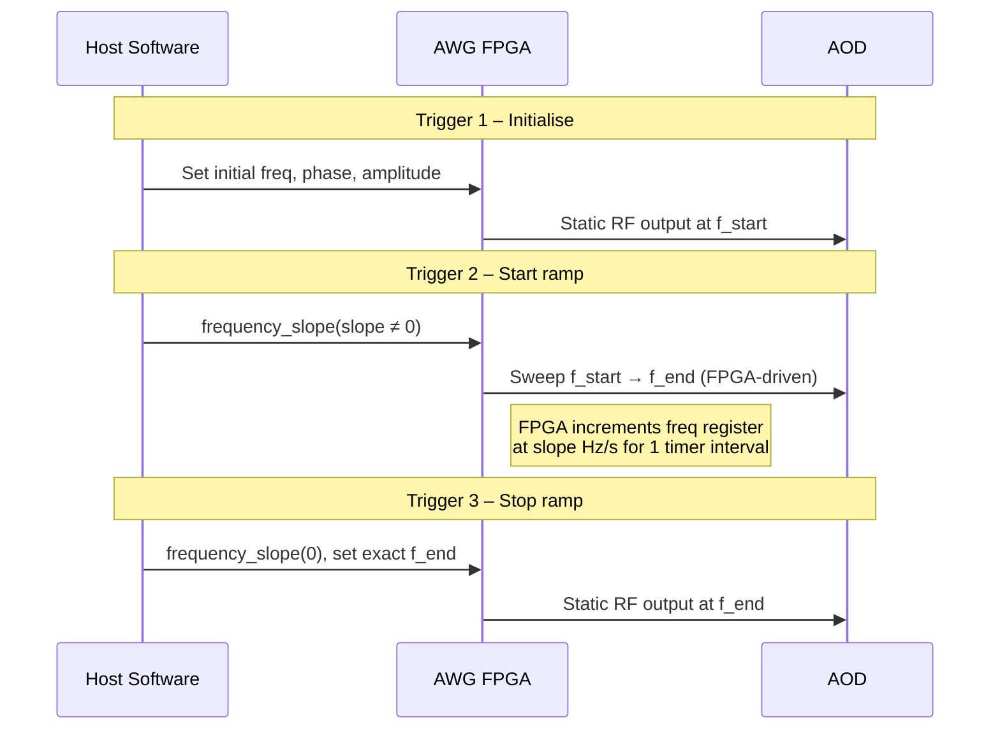

# DDS Strategy: Hardware Frequency Ramps (`DDSRampStrategy`)

## Overview

The **ramp strategy** uses the FPGA's built-in `frequency_slope()` register
to autonomously sweep DDS core frequencies at a computed rate (Hz/s).
Instead of the abrupt frequency hops used by the streaming strategy, the
FPGA interpolates smoothly between start and end frequencies, producing
continuous atom transport trajectories.

**Based on**: spcm DDS examples 03, 04, and 12.

## How It Works

### Linear Ramp (3 trigger events per move batch)



1. **Trigger 1**: Set initial frequencies, phases, and amplitudes for all cores.
2. **Trigger 2**: Activate `frequency_slope(slope)` on each core. The FPGA
   begins incrementing the frequency register at `slope` Hz/s.
3. **Trigger 3**: Set `frequency_slope(0)` to stop ramping, then set the
   exact final frequency to avoid accumulated rounding errors.

The ramp duration equals one trigger-timer interval (`trigger_timer_s`).

### Slope Computation

```
slope = (f_end − f_start) / trigger_timer_s
```

For a static tone (no motion): `slope = 0`.

### S-Curve Ramp (piecewise-linear cosine profile)

When `use_scurve=True`, the linear ramp is replaced by a piecewise-linear
approximation of a raised-cosine profile (minimum-jerk transport):

```
f(t) = f_start + Δf · (1 − cos(π · t / T)) / 2
```

This creates smooth acceleration and deceleration, reducing heating and
atom loss during transport. The profile is divided into `scurve_segments`
linear segments (default: 16), each with its own slope value.

**Trigger events**: 1 (init) + N (segments) + 1 (final) = N + 2 total.

## Configuration

```python
from atommover.utils.dds_strategies import DDSRampStrategy, RampConfig

# Linear ramp (default)
strategy = DDSRampStrategy()

# S-curve ramp
strategy = DDSRampStrategy(config=RampConfig(
    ramp_stepsize=1000,    # Clock cycles between FPGA freq updates
    use_scurve=True,       # Enable cosine S-curve profile
    scurve_segments=16,    # Number of piecewise-linear segments
))
```

### Using with the Controller

```python
from atommover_controller import AtommoverController, HardwareConfig, SoftwareConfig

ctrl = AtommoverController(
    sw_config=SoftwareConfig(...),
    hw_config=HardwareConfig(trigger_timer_s=0.1),  # Ramp duration!
    strategy="ramp",
)
```

Or with S-curve:

```python
ctrl = AtommoverController(
    sw_config=SoftwareConfig(...),
    hw_config=HardwareConfig(trigger_timer_s=0.1),
    strategy=DDSRampStrategy(config=RampConfig(use_scurve=True)),
)
```

## ⚠️ Safety Instructions for Experimental Testing

### CRITICAL: Voltage Limits

> **The output amplitude in the script MUST be below 2.0 V.**
>
> `HardwareConfig.max_amplitude_v` defaults to 1.6 V.
> **NEVER set this above 2.0 V.**
> Exceeding this limit will damage the AOD amplifier.

### Before Connecting to the AOD

1. **Start with the amplifier output disconnected from the AOD.**
2. Run the controller script with your chosen ramp parameters.
3. Connect an oscilloscope to the amplifier output.
4. Verify:
   - Peak voltage stays below the AOD damage threshold.
   - Frequency sweep is smooth (no spikes or glitches).
   - Amplitude remains constant during the ramp.
5. **Only after verification**, connect the amplifier to the AOD.

### Ramp-Specific Safety Checks

- **Slope magnitude**: Very large slopes can cause transient voltage spikes.
  Start with moderate slopes (< 200 MHz/s) and increase gradually.
- **Ramp stepsize**: Very small values (< 100) increase FPGA update rate
  and may cause timing issues. Default of 1000 is safe.
- **S-curve segments**: More segments = more trigger events = longer total
  time. Ensure the total duration doesn't exceed your experimental window.

### Testing Procedure

1. Set `HardwareConfig.max_amplitude_v = 1.0` (conservative start).
2. Use a single-core test (1×1 grid) to verify basic ramp functionality.
3. Increase to full grid and verify amplitude budget (40% per channel).
4. Switch to S-curve and verify smooth transport profile on oscilloscope.
5. Gradually increase amplitude toward production value (≤ 1.6 V).

## Comparison with Other Strategies

| Property | Streaming | **Ramp** | Pattern | Camera-Triggered |
|---|---|---|---|---|
| Frequency transitions | Abrupt hop | **Smooth sweep** | Abrupt hop | Abrupt hop |
| FIFO underrun risk | Yes | Yes (during prefill) | No | No |
| Commands per batch | 1 trigger | **3 triggers** (linear) | 3 triggers | 3 triggers |
| S-curve support | No | **Yes** | No | No |
| Software jitter | Timer-paced | **FPGA-driven ramp** | Polled | Hardware-synced |
| Atom transport quality | Baseline | **Best** | Baseline | Baseline |
| Complexity | Low | **Medium** | Medium | High |

## spcm API Reference

Key spcm calls used by this strategy:

```python
dds[core].frequency_slope(slope_hz_per_s)  # Set FPGA ramp rate
dds[core].frequency_slope(0.0)             # Stop ramping
dds.freq_ramp_stepsize(1000)               # FPGA update granularity
dds[core].freq(float(f_hz))               # Set exact frequency
dds.exec_at_trg()                          # Queue for next trigger
dds.write_to_card()                        # Flush command buffer
```
