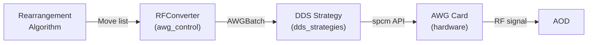

# AWG Controller

Hardware control package for driving Spectrum Instrumentation AWG cards with DDS (Direct Digital Synthesis) during atom rearrangement.

## Overview

This package isolates all AWG / DDS control logic from the `atommover` simulation framework. It translates logical atom moves into RF frequency ramps executed by the card's DDS cores, driving acousto-optic deflectors (AODs) that physically reposition trapped atoms.



## Directory Structure

```
awg_controller/
├── src/
│   ├── __init__.py          # Re-exports public API
│   ├── awg_control.py       # RFConverter, AODSettings, AWGBatch, hardware constants
│   └── dds_strategies.py    # 4 DDS strategy classes + registry
├── scripts/
│   └── atommover_controller.py   # Closed-loop feedback controller
├── tests/
│   ├── test_awg_control.py       # RFConverter unit tests
│   └── test_controller_pipeline.py  # Full pipeline integration tests
├── docs/
│   ├── dds_strategy_ramp.md           # FPGA frequency ramp documentation
│   ├── dds_strategy_pattern.md        # Pattern-based execution documentation
│   └── dds_strategy_camera_triggered.md  # Camera-triggered documentation
├── config/                   # Hardware configuration templates
└── README.md                 # This file
```

## Hardware

### Spectrum Instrumentation AWG Card

- **DDS cores**: 21 total (indices 0–20)
- **Channel 0** (V / row AOD): cores 0–7, 12–19 (exclusive); cores 8–11 (flex)
- **Channel 1** (H / col AOD): cores 8–11 (flex) + core 20 (fixed)
- **Maximum tones**: 20 on ch0 (single ch1) or 16 on ch0 + 5 on ch1 (dual ch1)
- **Amplitude budget**: 40 % of full-scale per channel, distributed equally across active tones

### What to Look Out For

> **Output amplitude MUST stay below 2.0 V at all times.**
> The default `HardwareConfig.max_amplitude_v` is 1.6 V.
> **Exceeding 2.0 V will permanently damage the AOD amplifier.**

- **Always test with an oscilloscope** before connecting the amplifier to the AOD.
- Start with `max_amplitude_v = 1.0` (conservative) and increase gradually.
- The camera-triggered strategy enforces `trigger_level_v < 2.0 V` with a hard `ValueError`.
- Use `validate_hardware_limits(grid_rows, grid_cols)` at startup to fail fast if grid dimensions exceed DDS core capacity.

## DDS Strategies

Four interchangeable strategies implement the `DDSStrategy` interface:

| Strategy | Trigger | Frequency transition | Key advantage |
|---|---|---|---|
| `streaming` | TIMER | Abrupt hop | Simple, battle-tested |
| `ramp` | TIMER + FPGA slope | Smooth sweep | Best transport quality, S-curve support |
| `pattern` | TIMER + CARD + `force()` | Abrupt hop | No FIFO underrun risk |
| `camera_triggered` | TIMER + CARD + ext0 TTL | Abrupt hop | Zero software jitter, hardware-synced |

Select a strategy by name or instance:

```python
from awg_controller.src.dds_strategies import get_strategy

strategy = get_strategy("ramp", use_scurve=True, scurve_segments=16)
```

Detailed documentation for each strategy is in `docs/`.

## Usage

### RF Conversion (no hardware needed)

```python
from awg_controller.src.awg_control import RFConverter, AODSettings
from atommover.utils.core import PhysicalParams
from atommover.utils.Move import Move

settings = AODSettings(
    f_min_v=60e6, f_max_v=100e6,
    f_min_h=60e6, f_max_h=100e6,
    grid_rows=10, grid_cols=5,
)
converter = RFConverter(settings, PhysicalParams())

# Convert moves to RF commands
batch = converter.convert_moves([Move(0, 0, 2, 1)])
print(f"{len(batch.ramps)} ramps, {batch.total_duration_s*1e6:.1f} µs")
```

### Full Controller (simulation mode)

```python
from awg_controller.scripts.atommover_controller import (
    AtommoverController, HardwareConfig, SoftwareConfig,
)

sw = SoftwareConfig(grid_size=10, target_size=6, algorithm_name="PCFA")
hw = HardwareConfig(trigger_timer_s=0.2)

with AtommoverController(sw, hw, strategy="ramp") as ctrl:
    success = ctrl.run()
```

### Full Controller (with hardware)

```python
hw = HardwareConfig(
    card_paths=["/dev/spcm0"],
    max_amplitude_v=1.6,        # NEVER exceed 2.0 V
    trigger_timer_s=0.2,
)
sw = SoftwareConfig(
    grid_size=10, target_size=6,
    algorithm_name="PCFA",
    aod_settings=AODSettings(
        f_min_v=60e6, f_max_v=100e6,
        f_min_h=60e6, f_max_h=100e6,
        grid_rows=10, grid_cols=5,
    ),
)

with AtommoverController(sw, hw, strategy="pattern") as ctrl:
    success = ctrl.run(initial_image="fluorescence.png")
```

### CLI

```bash
python awg_controller/scripts/atommover_controller.py \
    --algorithm PCFA \
    --grid-rows 10 --grid-cols 5 \
    --target-rows 6 --target-cols 5 \
    --strategy ramp \
    --trg-timer 0.2
```

## Testing

Run all AWG controller tests (no hardware required):

```bash
pytest awg_controller/tests/ -v
```

## spcm Documentation

This package builds on the [spcm Python driver](https://github.com/SpectrumInstrumentation/spcm) for Spectrum Instrumentation cards. Key references:

- [spcm GitHub repository](https://github.com/SpectrumInstrumentation/spcm)
- [spcm DDS examples](https://github.com/SpectrumInstrumentation/spcm/tree/master/src/examples) — examples 03, 04, 09, 12, 15 form the basis of the four strategies
- [Spectrum documentation portal](https://spectruminstrumentation.github.io/spcm/spcm.html)

## Dependencies

- **Runtime**: `numpy`, `spcm` (optional — simulation mode works without it)
- **Algorithms & imaging**: `atommover.algorithms`, `atommover.utils` (from the parent repo)
- **Tests**: `pytest`, `numpy`
